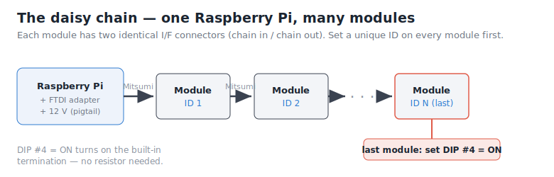
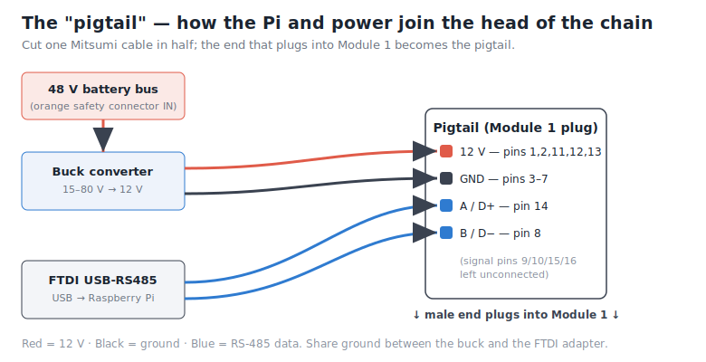

# Getting Started — a complete beginner's guide

You have some Murata battery modules and you want to *see* them — voltage, charge, temperature,
alarms — on a screen. This guide takes you from **nothing** to a **live dashboard in your browser**,
assuming zero prior knowledge. If you can follow a recipe, you can do this.

By the end you'll have a small Raspberry Pi sitting next to your batteries, and you'll open a web
page like `http://192.168.1.42:8080` on your phone or laptop and watch your whole battery system.

---

## ⚠️ READ THIS FIRST — the one thing that can hurt you or your batteries

**This software watches your batteries. It does NOT protect them. It cannot disconnect anything.**

The modules raise alarms (over-voltage, under-voltage, over-temperature…) and this software will
happily *show* you those alarms — but **nothing acts on them.** A Murata module signals a problem; it
does **not** open the circuit itself (in the original factory system, a separate device called a BMU
did that).

So before you connect a live battery bank, **you must have your own way to stop the current** when
something goes wrong — for example:

- your **inverter's** built-in high/low-voltage cut-off, or
- a **contactor / breaker** you can trip, or
- simply **being present and pulling the disconnect** during testing.

Without a disconnect strategy, a single stuck fault can **drain a module flat and permanently kill
it** (this is a real, common way these modules die). Decide how you'll cut the current *before* you
energize anything. This tool is your eyes, not your hands.

---

## What you'll need (shopping list)

| # | Item | Notes |
|---|------|-------|
| 1 | **Raspberry Pi 4B (4 GB)** + official USB-C power supply | 4 GB lets you *also* run Home Assistant on it later. Engine-only works on a Pi 3 or Pi Zero 2 W too. |
| 2 | **microSD card, 16–32 GB** | A decent brand (SanDisk/Samsung). It runs 24/7, so don't buy the cheapest. |
| 3 | **Genuine FTDI USB-to-RS485 cable** (e.g. FTDI `USB-RS485-WE`) | **Get real FTDI.** Our speed optimizations are FTDI-specific. Avoid cheap CH340 clones. |
| 4 | **DC-DC buck converter, 15–80 V → 12 V, ≥1 A** | Powers the modules' little communication boards. See "Powering" below. |
| 5 | **Mitsumi daisy-chain cables** | The hard part. **When you buy modules, insist on getting the Mitsumi cables with them** — they're difficult to source separately. |

You do **not** need a termination resistor — the modules have termination built in (you enable it
with a DIP switch on the last module, see Step 1).

---

## The mental model (30 seconds)

- **Module** — one Murata battery brick. It measures itself and talks over a wire.
- **Bank** — several modules wired together in a chain on one cable run.
- **ESS** — your whole system (one or more banks). "Energy Storage System."

This software polls every module, adds them up into a bank, and shows you the bank and each module.

---

## Step 1 — Set each module's ID **before** you wire anything

Every module on the chain needs a **unique address** (1, 2, 3, …), or they'll talk over each other.
You set it with physical switches on each module.

1. **Pull the orange power/safety connector** on the module. This deadens the big B+/B− terminals
   **and** reveals the ID switches — do this first, always.
2. Set the **hex rotary switch** and **DIP 1 / DIP 2** to give each module a unique number. See
   [`docs/hardware/murata-module.md`](hardware/murata-module.md) §4 for the exact switch table
   (the rotary picks 1–16, DIP1/DIP2 pick which block, together covering IDs 1–64).
3. Number them **1, 2, 3 … N** in the order they'll sit in the chain. Never reuse a number.
4. On the **last module in the chain**, also set **DIP #4 = ON.** This turns on the built-in bus
   termination (that's why you don't need a resistor).

Write the ID on a piece of tape on each module. You'll thank yourself later.

---

## Step 2 — Wire it up

### Powering the modules (two ways)

The modules' communication boards need **12 V**. You have two options:

- **Bench / safe (testing one or a few modules):** leave the orange connector **pulled** (big
  terminals dead) and feed **12 V from any small supply** into the module's I/F connector. Full
  communication, **zero high-current risk.** Great for first tests.
- **Live / minimalist (real install):** insert the orange connector (the 48 V bus goes live), and
  use the **buck converter to tap the 48 V bus and step it down to 12 V**, feeding the modules'
  comm boards. The system powers its own communications. *(This is a live 48 V system — mind the
  disconnect-strategy warning above, and fuse the tap.)*

### The chain

Modules daisy-chain module-to-module with the Mitsumi cables (each module has two identical I/F
connectors — one "in", one "out"):



### The "pigtail" — how the Pi and power join the chain

The head of the chain needs to inject **12 V + ground** and tap the **RS-485 data pair (A/B)**. The
easiest way (if you have a spare Mitsumi cable): **cut one cable in half** and use the end that plugs
into Module 1 as a "pigtail":

- **Data:** the two RS-485 pins (A/B) → the FTDI cable's **Data+ / Data−** wires.
- **12 V:** **bundle all the 12 V pins together** → buck converter **+12 V**.
- **Ground:** **bundle all the ground pins together** → buck/​supply **ground** (and share ground
  with the FTDI cable).
- The male end plugs into **Module 1's** I/F connector.



The 16-pin connector pinout (which pin is which):


> If the data won't communicate, **try swapping the A/B pair** (pins 8 & 14) — RS-485 "A/B" labeling
> is notoriously inconsistent and swapping is harmless. Full details in
> [`docs/hardware/murata-module.md`](hardware/murata-module.md).

Plug the **FTDI USB end into the Raspberry Pi.**

---

## Step 3 — Set up the Raspberry Pi

1. Download **Raspberry Pi Imager** (from raspberrypi.com) onto your computer.
2. Insert the microSD card. In Imager, choose **Raspberry Pi OS Lite (64-bit)** (no desktop needed).
3. Click the **gear / edit settings** before writing, and set:
   - a **hostname** — e.g. `omb` (you'll reach it at `omb.local`),
   - **enable SSH** (password login is fine to start),
   - your **Wi-Fi** name + password (or plan to use an Ethernet cable),
   - a username/password you'll remember.
4. Write the card, put it in the Pi, connect the FTDI adapter, and power the Pi on.
5. From your computer, open a terminal and connect:
   ```bash
   ssh <your-username>@omb.local
   ```
   (If `omb.local` doesn't resolve, find the Pi's IP in your router's device list and use that.)

**Powering the Pi:** for now, its **normal USB-C wall adapter** is perfectly fine. *(Better, later:
power the Pi from the battery too — a second small 48 V→5 V buck — so your monitoring keeps running
even during a grid outage. Same spirit as the rest of this project: don't depend on things that can
disappear.)*

---

## Step 4 — Install the software (one command)

On the Pi (the terminal you just SSH'd into), paste:

```bash
curl -fsSL https://raw.githubusercontent.com/saxophone-k/open-murata-bms/main/install.sh | bash
```

It installs everything, then **asks you a few plain questions** — how many modules, USB adapter or
network gateway, whether you also want Home Assistant. Answer them (press Enter to accept the
defaults), and it starts automatically on every boot.

When it finishes it prints your dashboard address.

---

## Step 5 — Open your dashboard 🎉

On any device on the same network (phone, laptop), open:

```
http://omb.local:8080          (or http://<the-pi-ip>:8080)
```

You should see your battery system: each module's voltage, charge, temperature, and any faults —
updating live. **That's it — you're monitoring.**

> Tip: give the Pi a fixed address in your router (DHCP reservation) so this URL never changes.

---

## Optional — Home Assistant

The dashboard above needs nothing else. But if you want **Home Assistant** (custom dashboards,
history graphs, automations, phone alerts), you need an **MQTT broker**.

- **Already run Home Assistant?** Just re-run `omb-setup`, say **yes** to Home Assistant, and point
  it at your broker. Your modules appear automatically as devices.
- **Don't run it yet?** The easy route is to install **Mosquitto** (the broker) — and optionally
  **Home Assistant** — **on this same Pi**. A 4 GB Pi 4 can host all three. (A short how-to for this
  will live in the docs; for now, any standard "install Mosquitto on Raspberry Pi" guide works, then
  set the broker to `127.0.0.1` in `omb-setup`.)

The web dashboard and Home Assistant can run **at the same time** — turning one on doesn't turn the
other off.

---

## Troubleshooting

| Symptom | Try |
|---|---|
| Dashboard shows **0 modules** | Check the FTDI cable is in the Pi; check A/B aren't swapped; confirm module IDs are set and unique. |
| **Some** modules missing | That module's ID may be wrong/duplicated, or a cable in the chain isn't seated. |
| Can't reach `omb.local` | Use the Pi's IP address instead (find it in your router). |
| A module shows **greyed-out / unavailable** | It stopped answering — check its connector and ID. |
| Want to change settings | `cd ~/open-murata-bms && ./.venv/bin/omb-setup config.yaml && sudo systemctl restart omb` |

Useful commands on the Pi:
```bash
systemctl status omb        # is it running?
journalctl -u omb -f        # live logs
```

---

## Updating

Re-run the installer any time — it pulls the latest version and restarts:

```bash
curl -fsSL https://raw.githubusercontent.com/saxophone-k/open-murata-bms/main/install.sh | bash
```

---

## Remember

This tool **shows** you problems; it does not **fix** them. Keep your disconnect strategy in place,
and never "clear" a module's fault without understanding why it happened. Enjoy seeing your
batteries. 🔋
