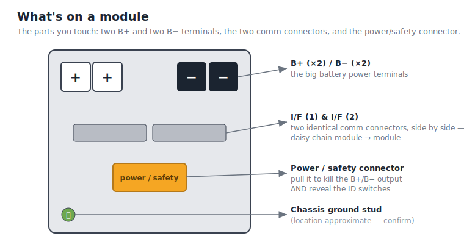
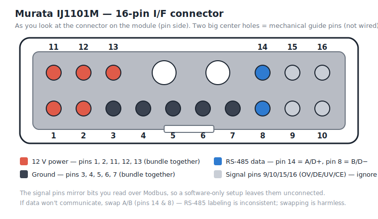
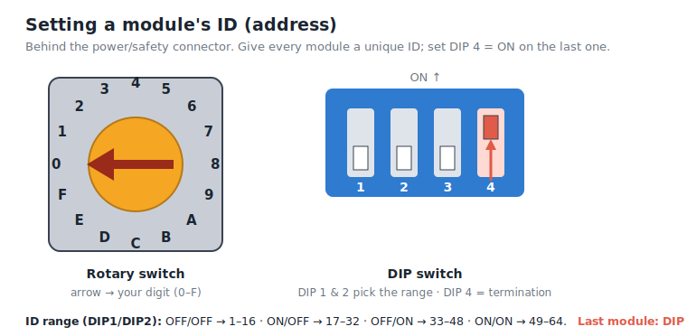

# Murata IJ1101M module — hardware & wiring (start here)

Written for someone holding **one Murata module** who knows nothing about it. Original write-up
(no vendor text). Verified against real hardware in 2026-07.

> ⚠️ **Read this first — the one thing that will bite you.** A Murata module is a **sensor and a
> signaller, not a switch.** It will *tell* you it's in trouble (over-voltage, under-voltage,
> over-temp) but it **cannot disconnect itself.** In the factory system a separate **BMU** opens a
> big power switch (an IGBT) when a module raises a flag. If you run modules **without** a BMU, that
> job is yours — nothing will stop a module from draining or overcharging itself unless *you* stop
> the current. (A module left flagging under-voltage for days will destroy itself. This has happened.)

---

## 1. What's on the module

Looking at the front face you have:

| Item | What it is |
|---|---|
| **LED** | Power + alarm status (see §6) |
| **I/F (1)** and **I/F (2)** | Two identical 16-pin communication connectors (RS-485 + 12 V + signals). Two so you can **daisy-chain** module→module. |
| **Power / safety connector** | A plug that **de-energizes the B+/B− terminals** when pulled. Pulling it also reveals the **ID switches** (§4). |
| **B+ / B−** | The actual battery power terminals (high current). |
| **Earth ground** | Chassis ground stud. |

The module is ~**48 V nominal**, ~**42 Ah / 2 kWh**, ~54.4 V full, 2.0 V/cell minimum.

---

## 2. Powering the module's brain (important, and non-obvious)

There are **two separate power domains**:

1. **The battery power** — the big **B+/B−** terminals. Controlled by the safety/power connector.
2. **The BMS/comms electronics** — powered by **12 V on the I/F connector** (pins 1/2/11/12/13).

The module's electronics **need that 12 V to talk.** In the factory the BMU/HUB feeds it. On a bench,
you supply it yourself — e.g. a **12 V DIN-rail supply** into the I/F connector. You can read a
module over comms with the **safety connector pulled and the big B+/B− terminals dead** — that's the
safe way to bench-test (no high current anywhere), because the BMS runs off your external 12 V.

---

## 3. The communication link

- **RS-485**, **Modbus RTU**, **230,400 baud, 8 data bits, Even parity, 1 stop bit**, no flow control.
- Master reads with **Function Code 0x04 (Read Input Registers)**. A full read is **75 registers
  from address 0x0000** (device info + live status). Recommended master timeout ~25 ms; retry on
  no-reply.
- To poll from a PC/Pi you need a **USB-RS485** (or RS485-to-Ethernet) adapter. Of the 16 pins, the
  ones that carry the actual data are just two: **pin 14 = A/D+** and **pin 8 = B/D−** — plus 12 V
  and GND to power the brain.

### 16-pin I/F connector pinout
Connector: Mitsumi **CAM-A62B** (16-pin). Pins 1/2/11/12/13 are tied together (12 V); pins 3–7 are
tied together (GND).

| Pin | Name | Meaning |
|----:|------|---------|
| 1, 2 | 12V | 12 V power **in** (±1 V) — powers the BMS/comms |
| 3–7 | GND | Signal ground |
| 8 | **B / D−** | RS-485 data − |
| 9 | OV | Over-voltage **signal out** (active-low, needs external pull-up) |
| 10 | DE | Discharge-enable **signal out** (active-low) |
| 11, 12, 13 | 12V | 12 V power **in** |
| 14 | **A / D+** | RS-485 data + |
| 15 | UV | Under-voltage **signal out** (active-low) |
| 16 | CE | Charge-enable **signal out** (active-low) |

> Pins **9/10/15/16 (OV/DE/UV/CE)** are the module "raising its hand" as hardware logic lines. They
> mirror bits you can also read over Modbus, so a software-only setup can ignore these pins and read
> the same faults from the **registers** instead.

---

## 4. Addressing — the rotary + DIP switches

Each module needs a **unique Modbus slave ID**. You set it with physical switches that appear once
you **pull the power/safety connector**:

- a **hex rotary switch** (positions **0–F**), plus
- **DIP 1** and **DIP 2**.

Together they select an ID from **1 to 64**: the rotary picks 1 of 16, and DIP1/DIP2 pick which
bank of 16:

| DIP1 | DIP2 | ID range (rotary 0→F) |
|:---:|:---:|:---|
| OFF | OFF | **1 – 16** |
| ON | OFF | 17 – 32 |
| OFF | ON | 33 – 48 |
| ON | ON | 49 – 64 |

Rules:
- **Never duplicate an ID** on the same bus.
- On the **last module in a chain**, set **DIP #4 = ON** (bus-end / termination marker).
- Real modules answer on IDs **1..N** (e.g. a cabinet of 18 uses IDs 1–18). An **absent ID just
  stays silent** — no error, so your poller must treat "no reply" as "not there," not a crash.

---

## 5. Wiring topology

### Communication (daisy chain)
The two I/F connectors let you chain modules: **I/F of the upper module → I/F of the lower module**,
down the stack, and the **last module → the BMU (or, BMU-less, your RS485 gateway/adapter).** All
modules sit on one shared RS-485 bus; each answers on its own ID. Keep a bus to **≤ ~32 modules**
(RS-485 electrical limit; a Murata BMU also maxes at 32).

### Power (parallel — the common home setup)
Modules in **parallel**: all **B+** together, all **B−** together, onto busbars. **Series** stacking
(B+ of one to B− of the next) is also supported for high-voltage strings, but most home banks are
48 V parallel.

> 🔌 **Before paralleling a module, match it to within 0.5 V of the others.** A low module dropped
> onto a live busbar gets **back-fed hard** by its neighbours (inrush). This matters especially when
> re-introducing a recovered/low module.

---

## 6. LED meaning

| LED | Meaning |
|---|---|
| Off | Module stopped / no BMS power |
| **Green, solid** | Normal |
| **Red, blinking** | Over-voltage / over-discharge / over-current (charge or discharge) |
| **Red, solid** | **Permanent failure** (latched) — do not just "reset" it; understand why first |

---

## 7. Before you power anything — checklist

1. **Bench-test with the safety/power connector pulled** so B+/B− are dead — feed the BMS from an
   external **12 V** supply on the I/F connector. You get full comms with zero high-current risk.
2. **Set a unique ID** on the switches (§4) before joining a module to a bus.
3. **Match voltages within 0.5 V** before paralleling (§5).
4. Confirm your adapter is **230400 / 8 / E / 1** and you're reading **A=pin 14, B=pin 8**.
5. Remember the module **won't protect itself** — decide *what stops the current* (inverter cut-out
   and/or your supervisor) **before** you connect it to anything that can charge or discharge it.

---

## 8. What you get when you read it

A single 75-register read returns: identity (product `IJ1101M`, vendor `SONY` or `MURA`, serial,
manufacture date, firmware), live **status/alarm/warning** bitfields, **current**, **DC voltage**,
**min/max cell voltage & temperature**, **state-of-charge**, **remaining / full-charge capacity**,
**state-of-health**, and **cycle count**. See the register map in
`src/omb/drivers/murata_module.py` (the same map the simulator uses).

*Open item: wire **colour codes** are not specified by Murata (only pin functions) — colours depend
on the harness/cable you build. If your install has a standard colour scheme, document it here.*
